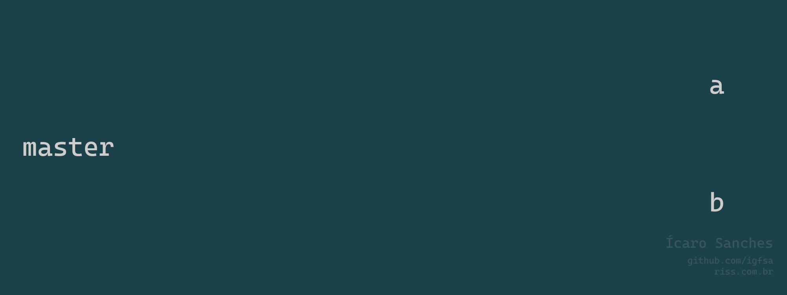
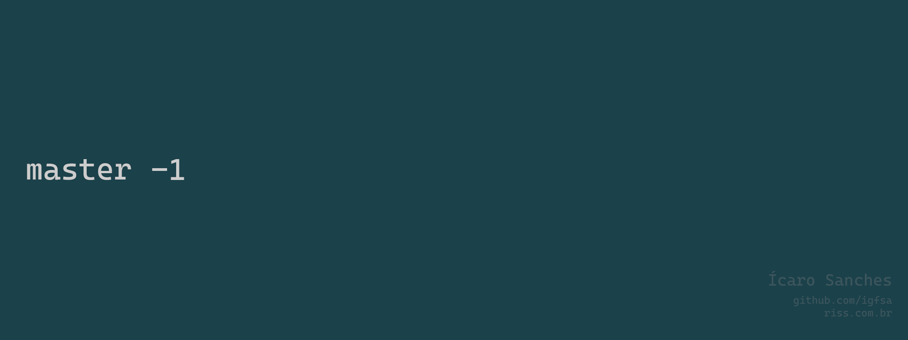

## Introdução ##

O Git é uma plataforma de versionamento de código. 
Através dele é possível  registrar e visualizar o histórico de arquivos e pastas.

---

## Iniciar o Git :checkered_flag: ##

&xrArr; O Git opera apenas em repositórios em que ele foi iniciado: 
	
`$ git init` 

---

## Verificar o status do repositório :eye: ##

&xrArr; É possível monitorar o projeto com o git, se existem mudanças a serem adicionadas ou commitadas, etc:

`$ git status`

---

## Ajuda :sos: ##

&xrArr; O git possui um comando com informações sobre uso do software:

`$ git --help`

&xrArr; Também é possível pesquisar por ajuda para algum comando em específico:

`$ git <comando> --help`

---

## Garbage Collector :wastebasket::recycle: ##

&xrArr; Limpar o projeto git de arquivos e pastas desnecessários ou criados erroneamente (garbage collector). Útil em casos de text file busy:

`$ git gc`

---

## Arquivo .gitignore :see_no_evil: ##

&xrArr; O arquivo .gitignore serve para adicionar diferentes arquivos ou tipos de arquivos que devem ser ignorados para o repositório git. Por exemplo, arquivos de testes, arquivos de banco de dados, ou arquivos com credenciais.
	
&xrArr; Podem ser adicionados:
* arquivos, como <exemplo.txt>;
* diretórios, como <**diretorio>, ao utilizar ** o git mapeia os subdiretórios;
* extensões, como <*.sql>, desta forma, todos os arquivos com a extensão indicada serão ignorados.
	
Este [link](https://github.com/github/gitignore) apresenta um repositório no git com modelos de gitignore para os principais tipos de projetos https://github.com/github/gitignore.

---

## Configurar usuário :wrench::technologist: ##

&xrArr; Ao iniciar o git em um repositório deve ser iniciado um usuário para identificar quem está realizando as operações:

`$ git config user.name "<usuario>"`

`$ git config user.email "<usuario@email.com>"`

&xrArr; Em computadores com apenas um usuário os usuários podem ser habilitados globalmente, assim ao iniciar um novo repositório o usuário será iniciado automaticamente:

`$ git config --global user.name "usuario"`

`$ git config --global user.email "usuario@email.com"`

---

## Git config :gear: ##

&xrArr; Ao utilizar `$ git config` estamos alterando o arquivo config dentro da pasta .git. Este arquivo é responsável pelas configurações do repositório Git. Usar --global indica que as configurações vinculadas estão se relacionando à todos repositórios na maquina.

&xrArr; Para buscar itens dentro de config podem utilizar a opção --get do comando. Por exemplo, buscar o nome do usuário configurado no repositório:

`$ git config --get user.name`

&xrArr; Também é possível listar todas configurações:

`$ git config -l`

---

## Adicionando arquivos ao índice :card_index_dividers: ##

&xrArr; Para adicionar ou atualizar um arquivo ao índice do repositório git, é necessário utilizar o comando:

`$ git add <arquivo> `

&xrArr; Podem ser adicionados ou atualizados todos arquivos ao mesmo tempo através do comando:

`$ git add . ` 

&xrArr; A adição de arquivos ao índice se faz necessária sempre que ocorra criação ou alteração de um arquivo no repositório e é obrigatório que todos arquivos estejam indexados para realizar um commit.

---

## Commit :white_check_mark: ##

&xrArr; Após a inclusão dos arquivos no índice do repositório, é necessário realizar um commit, que indicará o estado atual do índice, criando um identificador (hasid) o qual é adicionado ao log do repositório:

`$ git commit -m '<mensagem>'`

A opção -m do comando commit permite adicionar uma mensagem ao commit realizado. Este processo é obrigatório ao realizar um commit e caso a operação seja feita sem o uso de -m, será aberto um arquivo com a mensagem vinculada ao commit.

&xrArr; Como retorno do commit, recebemos informações da operação realizada e o hash id da operação no repositório remoto.

## Log :scroll: ##

&xrArr; Para visualizar o log do repositório:

` $ git log `

Aqui é possível identificar os commits que ocorreram no repositório. O hash id retornado quando realizamos um commit ao repositório são os 7 primeiros dígitos das identificações das operações retornadas no arquivo de log. Também são retornados o comentário e dados de hora e data e usuário.

&xrArr; Para navegar na saída do comando:
* A tecla enter exibe mais linhas
* ctrl+b volta para as linhas iniciais 
* Digitar `/<exemplo>` permite realizar busca dentro do log. 
* Para sair do arquivo digitar q.

&xrArr; O comando git log possui algumas opções especiais: 

* Para visualizar os últimos n logs:
  
    `$ git log -n`

* Para visualizar os logs resumidos em uma linha: 

    `$ git log --oneline`

* Para visualizar os logs antes de determinada data:

    `$ git log --before="<AAAA-MM-DD>"`

* Para visualizar os logs depois de determinada data:

    `$ git log --after="<AAAA-MM-DD>"`

* Para visualizar os logs desde de determinado tempo:

    `$ git log --since="<n> days ago"`

* Para visualizar os logs de determinado autor:

    `$ git log --author="<nome>"`

    *Obs: Case sensitive, porém realiza a busca parcial, não é necessário digitar o nome completo.

* Para alterar se o log será retornado exibindo todo o arquivo:

    `$ git config core.pager cat`

* Caso seja desejado que o log exiba apenas o tamanho da tela do terminal:

    ` $ git config core.pager less`

---

## Checkout :twisted_rightwards_arrows: ##

&xrArr; O arquivo log identifica os últimos commits no repositório local e remoto, no último commit vemos o indicativo head. Este indicativo mostra a "cabeça" atual do repositório.

&xrArr; Porém, é possível indicar outro id como head, assim fazendo com que a imagem dos arquivos volte ao ponto do commit indicado pelo hashid:

`$ git checkout <hashid>`

&xrArr; Para retornar ao último commit:

`$ git checkout <nome_branch_principal>`

---

## Renomeando arquivos :a::arrow_right::b: ##

 &xrArr; É possível utilizar o git para renomear arquivos ou diretórios:

`$ git mv <item> <novo_nome>`

&xrArr; Caso o rename de um item seja feito pelo explorador, será necessário executar o comando git add com o nome do item antigo.

---

## Apagando arquivos :wastebasket::file_folder: ##

&xrArr; Também é possível utilizar o git para deletar arquivos ou diretórios:

`$ git rm <item>`

&xrArr; Assim como para o rename, ao deletar um item pelo explorador, será necessário executar o comando git add com o nome do item antigo.

---

## Diff :mag: ##

&xrArr; É possível visualizar a diferença entre commits utilizando o git.

* Diferença entre o momento atual e o último commit:

    `$ git diff`

* Diferença entre as mudanças indicadas em status e o último commit:
	
	`$ git diff --staged`
	
* Diferença entre o momento atual e um específico commit:
	
    `$ git diff <hashid>`

* Diferença entre dois específicos commits:

    `$ git diff <hashid mais velho>..<hashid mais novo>`

---

## Emendas ao último commit :adhesive_bandage: ##

&xrArr; O comando amend permite alteração do último commit. Caso a mensagem do arquivo esteja errada ou tenha faltado algum item, este comando permite refazer no último commit:

`$ git commit --amend -m '<mensagem>'`

---

## Restaurando arquivos :arrow_heading_up: ##

&xrArr; Um item que foi adicionado ao estágio (através de git add) pode ser removido:

` $ git restore --staged <item>`

--- 

## Redefinindo arquivos :open_file_folder::arrow_heading_down: ##

&xrArr; É possível retornar um item ao ponto do último commit:

* Para arquivos que não foram colocados em estágio:

    `$ git checkout <item>`

* Caso tenha necessidade de fazer em todos os arquivos:

    ` $ git checkout .`

* Para arquivos que foram colocados em estágio:
    
    `$ git reset HEAD --hard`
    
    `$ git checkout HEAD -- .`
    
    * A opção -- faz com que o comando ignore opções adicionais.

&xrArr; Para retornar ao commit anterior após um novo commit:

`$ git reset HEAD' --hard`

---

## Redefinindo o repositório :card_file_box::arrow_heading_down: ##

&xrArr; Observa-se que o uso de git reset recebe como parâmetro um commit, então o comando pode ser utilizado para retornar o repositório para o estado em determinado commit:

`$ git reset <hashid> --hard`


 
&xrArr; O uso de reset sem usar um hashid e com a opção hard permite reverter a adição de arquivos ao índice (adicionados com git add), porém sem perder suas alterações:

`$ git reset HEAD`

---

## Branchs :arrow_up_down: ##

&xrArr; Branchs (ramificações) são utilizados para trabalhar com diferentes linhas de trabalho simultaneamente. Uma pessoa pode estar desenvolvendo uma funcionalidade ao mesmo tempo que outra pessoa está desenvolvendo outra.
A base de uma branch é o ponto de inicio da branch, o último commit em comum entre o ramo principal e o novo.



&xrArr; É possível ver as branchs existentes no projeto:
	
`$ git branch`

Na saída do comando, a branch principal (branch que está sendo utilizado no momento) é indicada com um asterisco.

&xrArr; Entre os comandos para lidar com branchs, destacam-se:

* Para criar uma nova branch:

	`$ git branch <nome_branch>`

* Para alterar para determinada branch:
  
	`$ git checkout <nome_branch>`

* Para criar um branch já em seu acesso: 

	`$ git checkout -b <nome_branch>`

	A opção -b cria um novo branch, é uma ação correspondente a executar a criação do branch e logo após acessá-lo.

* Para deletar um branch (obs.: o uso de -D ao invés de -d força a deleção de uma branch que não foi adicionada a principal através de merge ou rebase):

	`$ git branch -D <nome_branch>`

* Para renomear uma branch:

	`$ git branch -m 'nome-antigo' 'nome-novo' `

---

## Merge :arrow_right::o::arrow_left: ##

&xrArr; Merges mesclam duas branchs em um novo commit posterior na branch principal.



&xrArr; Para realizar a operação entre entre branchs deve ser executado o comando:

`$ git merge <nome_branch>`

O comando deve ser rodado da branch principal com o parâmetro sendo a branch a ser adicionada.
		
Após o merge, a branch auxiliar pode ser deletada:

`$ git branch -d <nome_branch>`

Aqui não é necessário usar o -D para forçar o delete, pois a branch já está adicionada a branch principal. 

---

## Rebase :arrows_counterclockwise: ##

&xrArr; Rebases inserem as mudanças da branch no momento da base e criam uma nova base a partir deste ponto, inserindo as modificações feitas na main após a nova base:


&xrArr; Para fazer um rebase entre branchs:

`$ git rebase <nome_branch>`

O comando deve ser rodado da branch principal com o parâmetro sendo a branch a ser adicionada.

&xrArr; Após o rebase, a branch auxiliar pode ser deletada:

`$ git branch -d <nome_branch>`

---

## Clonando repositórios :mage::mirror::mage: ##

&xrArr; É possível utilizar o git para clonar projetos em diferentes locais:
	
`$ git clone <projeto base> <local de clonagem>`

Repositórios clonados podem buscar e enviar novos commits na origem, caso a mesma permita.

---

## Recebendo atualizações de commit, fetch :file_cabinet::incoming_envelope::card_file_box::eyeglasses: ##

&xrArr; Trabalhando de um projeto clonado é possível buscar novos commits sem realizar mesclagem com o trabalho feito no projeto de origem:

`$ git fetch`

Os arquivos ficam armazenados dentro da pasta config. Para serem adicionados na pasta principal, deve ser realizado um rebase ou um merge.

--- 

## Recebendo atualizações de commit, pull :file_cabinet::incoming_envelope::card_file_box::file_folder: ##

&xrArr; É possível realizar as operações de fetch e rebase juntamente:

`$ git pull`

Para realizar um pull, o projeto corrente não deve possuir commits a serem enviados para o projeto de origem.

--- 

## Repositórios bare :card_file_box::left_right_arrow::file_cabinet::left_right_arrow::card_file_box: ##


&xrArr; Bare repositories são repositórios centralizados, utilizados para compartilhamento de códigos entre diferentes sessões. Repositórios no GitHub são exemplos de bare repository.

Permite que outros repositórios enviem push com commits que contenham modificações para esse repositório central.

Ao criar um bare, o repositório é iniciado sem a pasta .git, o conteúdo dessa pasta é criado diretamente na pasta. 

Para criar:
	
`$ git init --bare`

Os diretórios que irão enviar as modificações ao bare devem clonar o diretório bare inicial.

---

## Enviando atualizações de commit, push :file_folder::incoming_envelope::file_cabinet: ##

&xrArr; Com o uso de bare repositories é possível subir para o repositório central modificações feitas:

`$ git push`

---

## Enviando novas branchs ao repositório central :arrow_up_down::incoming_envelope::file_cabinet: ##

&xrArr; Ao criar novas branchs para um repositório central, é necessário que após cria-lás no repositório local seja feito o envio da branch para o repositório remoto. Também é necessário configurar o ponto de montagem do repositório local para o repositório remoto. Assim será possível enviar commits feitos dentro daquela branch. Uma vez criada, ambas operações podem ser realizadas através do seguinte comando: 

`git push --set-upstream origin <nova_branch>`

---

## Tags :label: ##

&xrArr; As tags no git marcam um determinado commit, representando o momento indicado. Similar aos branchs, onde ao realizar um branch é criado uma base para o mesmo, porém as tags não permitem novos commits baseados nelas.

Tags são úteis para versionamento ou entregas parciais de funcionalidade por exemplo. Permitem que o ambiente seja copiado ou visualizado no momento que foi criada.


&xrArr; Para criar uma tag:

`$ git tag <nome_tag>`

&xrArr; Para visualizar as tags existentes:

`$ git tag`

&xrArr; Após a criação a tag deve ser enviada via push para o repositório centralizador:

`$ git push origin <nome_tag>`

&xrArr; Uma vez no repositório central, ela funcionará como outros objetos (como branchs), sendo necessário que os outros repositórios façam um pull para acessá-la.

&xrArr; É possível acessar as tags e visualizar o repositório em seu momento

`$ git checkout <nome_tag>`

&xrArr; Como não é possível realizar commits em tags, para trabalhar nas mesmas é necessário criar um branch baseado na tag. É possível criar e já fazer o acesso com apenas um comando:

`$ git switch -c <nome_branch>`

`$ git checkout -b <nome_branch>`


Os comandos acima realizam a mesma ação. O comando checkout foi inserido primeiramente e realiza ações visando branchs e arquivos. O git, para evitar confusões, em 2019 criou os comandos switch para manipular apenas branchs e restore para manipular apenas arquivos.

&xrArr; Após a criação da branch o processo de criação e edição de itens, além do processo de commits são feitos de forma normal. Uma vez finalizada as alterações na branch ela pode ser mesclada à master e pode ser criada uma nova tag.

---

## Git Revert :arrows_clockwise::card_file_box: ##

&xrArr; O comando revert volta os objetos do repositório para um commit indicado, porém não remove os commits anteriores, gerando um novo commit. Desta forma, alterações que foram feitas ainda podem ser acessadas pelo log do repositório

`$ git revert <hashid>`

Por padrão o comando já commita as mudanças em sua execução. É um atalho para realizar checkout dos arquivos para um momento anterior, adição de arquivos em estágio e commit com uma mensagem indicando a mudança 

Este comando é útil pois mudanças que forem descartadas ainda podem ser vistas no log do repositório

Funciona de forma análoga ao comando reset, porém o comando reset remove os commits entre o commit indicado e o momento atual


---

## Tratando conflitos :bow_and_arrow::white_flag::dagger: ##

 &xrArr; Conflitos ocorrem quando ao realizar um commit há diferença na imagem do último commit e na imagem do repositório no momento atual (como imagem entende-se o repositório antes das modificações adicionadas ao índice). Por exemplo, ao operar com um repositório remoto, caso tenha ocorrido modificações no repositório remoto após o último pull, os arquivos de referência estarão diferentes do momento que os arquivos foram editados na máquina local. Portanto, o repositório terá diferença entre a imagem do último commit e o real último commit.   
 
 Para projetos com divergências entre branchs, se faz necessário tratar os erros de conflito. 

Por padrão o Git não realiza mais trativas para divergências e exibe uma mensagem de erro.

```
		hint: You have divergent branches and need to specify how to reconcile them.
		hint: You can do so by running one of the following commands sometime before
		hint: your next pull:
		hint: 
		hint:   git config pull.rebase false  # merge (the default strategy)
		hint:   git config pull.rebase true   # rebase
		hint:   git config pull.ff only       # fast-forward only
		hint: 
		hint: You can replace "git config" with "git config --global" to set a default
		hint: preference for all repositories. You can also pass --rebase, --no-rebase,
		hint: or --ff-only on the command line to override the configured default per
		hint: invocation.
```

Conforme exibido na mensagem, existem 3 maneiras de lidar com a situação que podem ser configuradas através de git config: 

* merge commit (comportamento padrão histórico)

	`$ git config pull.rebase false`

	Cria um novo commit que é pai dos commits que estão em conflito. Por sem um merge, pode gerar conflitos.

* rebasing nos commit locais 

	`$ git config pull.rebase true`

	Ao realizar um rebase nos commits locais, é possível adicionar os commits do servidor remoto na master branch primeiramente e depois realizar um merge entre este e nossos commits locais. Devido ao merge também pode gerar conflitos

* não faça nada por padrão (fast-forward)

	`$ git config pull.ff only` 

	Realiza as operações que não requerem nenhuma tratativa de conflitos, caso seja necessário, o processo é abrotado e é retornado uma mensagem de erro. 

	É uma estratégia que possui benefícios pois os conflitos são tratados manualmente, assim reduzindo a chance de erros ou correções impróprias.

Independente das configurações aplicadas, é possível aplicar um pull com instruções para rebase simples 

`$ git pull --rebase`
		
Ou realizar um merge commit 

`$ git pull --rebase=merges`

Essas duas opções apresentam a necessidade de tratar as divergências manualmente, o que cria a necessidade de análise dos arquivos e assim realizar as operações para a criação de um commit.

Será criado uma branch detached para as ações necessárias. Uma vez nela, para acompanhar o que foi realizado e o que ainda deve ser feito pode ser utilizado o comando status.

Com as alterações adicionadas para estágio, será necessário realizar um commit e continuar o rebase 

`$ git rebase --continue`		
		
Após essas operações, será retornado para a branch principal com um novo commit realizado, assim criando a necessidade de realizar por fim o pull
